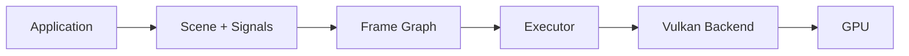

<h1 align="center">gLexShrD</h1>

<strong>A math-first, type-safe graphics engine built on Vulkan (Work In Progress)</strong> 
<em>Express mathematical intent. The engine handles GPU orchestration.</em>

---

GlexShrD is an experimental graphics engine where ***animations and geometry** are discribed, and the engine compiles that into **correct, synchronized GPU execution**. The rendering backend is Vulkan, but the core architecture is backend-agnostic by design.
Combining:
- declarative rendering
- safe GPU abstraction
- deterministic frame graph execution
- backend-agnostic architecture

---

## Repository Status

⚠ **Partial Architecture Published**

This repository currently contains **only a subset of the engine architecture**.  
Several internal crates and core modules are **not included in the public repository yet**.

As a result:

- The project **will not compile if cloned directly**
- Missing modules will be added progressively as the architecture stabilizes
- The repository is intended **for architectural inspection and development tracking**, not for building or production use

The issue tracker reflects the **actual development process**, even when the corresponding code has not been published yet.
## Development

For a peek into active development and ongoing work:
- [Issue Tracker](https://github.com/RITIKESHDUTT/gLexShrD/issues)

## System Overview

| Property | Current State |
|:---|:---|
| **CPU threading** | Single-threaded. One thread owns platform, GPU context, and frame loop. |
| **GPU concurrency** | Asynchronous triple-buffered (`FrameSync<3>`). Up to 3 frames in-flight across GPU pipeline stages. |
| **CPU-GPU sync** | Timeline semaphores (monotonic `u64`). Non-blocking slot query &mdash; `begin_frame()` returns `false` instead of stalling. Binary semaphores for swapchain acquire/present only. |
| **Queue model** | Multi-queue capable. `Executor` holds optional `WorkLane`s for Graphics, Compute, and Transfer with automatic cross-queue barriers. |
| **Execution model** | Retained-mode frame graph &mdash; passes declared, compiled via topological sort, barriers inserted automatically. |
| **Memory model** | Manual allocation. No sub-allocator. Memory type indices precomputed at init (`MemoryIndices`). |
| **Presentation** | VSync (FIFO) or Mailbox. Swapchain recreated on resize. |

---

## Codebase structure & navigation

- `src/lib.rs` &mdash; public API surface exporting `Glex`, `VulkanContext`, `WaylandPlatform`, and `WaylandWindowImpl`.
- `src/infra/` &mdash; platform and backend plumbing.
  - `platform/` handles Wayland window integration (planned: X11/DRM backends).
  - `vulkan/` holds the Vulkan context, memory helpers, and low-level backend bindings.
- `src/core/` &mdash; engine internals.
  - `cmd/` for command recording, `render/` for render graph nodes, `resource/` for resource descriptions, `backend/` for abstraction traits, `exec/` for the frame-graph executor, and `sync/` for timeline semaphore management.
- `src/renderer/` &mdash; higher-level rendering pieces: pipelines, shader utilities, and example shaders (e.g., `shaders/particle_vortex/`).
- `src/engine/`, `src/runtime/`, `src/domain/`, `src/lin_al/` &mdash; scaffolding for the runtime, math utilities, and domain-specific layers (parts are intentionally stubbed while the architecture is published gradually).
- `tests/csd_test.rs` &mdash; integration test exercising Wayland window creation and Vulkan context bootstrap through `Glex`.

### Key technologies
- Rust 2024, Vulkan 1.3 via `ash`
- Error handling with `thiserror`; logging/diagnostics with `tracing` + `tracing-subscriber`
- Concurrency primitives from `crossbeam-queue`, flags via `bitflags`, stack-friendly arrays via `arrayvec`

### Building and testing
- Commands (once all workspace members are present):
  - Build: `cargo build --verbose`
  - Tests: `cargo test --verbose` (integration test in `tests/`)
  - Release: `cargo build --release` (LTO, single codegen unit)
- Current status: the workspace references crates that are **not yet published** (`glex-platform`, `glex-shader-macro`, `glex-shader-types`), so fresh clones will see build/test failures until those members are added. The code is published primarily for architectural inspection.

---

## Limitations & Roadmap

| Current Limitation | Intended Direction |
|:---|:---|
| Single-threaded CPU | Parallel command recording (one `CommandPool` per thread) |
| No memory sub-allocator | Arena/pool allocator in `VulkanContext` |
| `Glex::frame()` is sealed | Expose `&mut FrameGraph` to user via render closure |
| Hardcoded Wayland | `Platform` trait exists; X11 and DRM backends planned |
| No multi-pass effects | `FrameGraph` supports it &mdash; needs exposure through `Glex` |

---

##  Design Philosophy

| Principle | Meaning                                                                                        |
|:---|:-----------------------------------------------------------------------------------------------|
| **Math-driven rendering** | describe geometry and animation mathematically. The engine translates to GPU operations.       |
| **Compile-time safety** | Type-state FSMs catch synchronization and resource errors before runtime.                      |
| **Minimal GPU surface area** | Users should not need to understand Vulkan to use the engine.                                  |
| **Platform-renderer separation** | Windowing is a subcrate. The renderer is backend-agnostic by trait.                            |
| **Deterministic execution** | Frame graphs are compiled into a fixed execution order. No implicit state, no hidden mutation. |

> The engine should convert **mathematical animation intent** into **correct GPU execution**, absorbing the complexity of Vulkan internally.

---

Work in progress &mdash; architecture subject to change.

